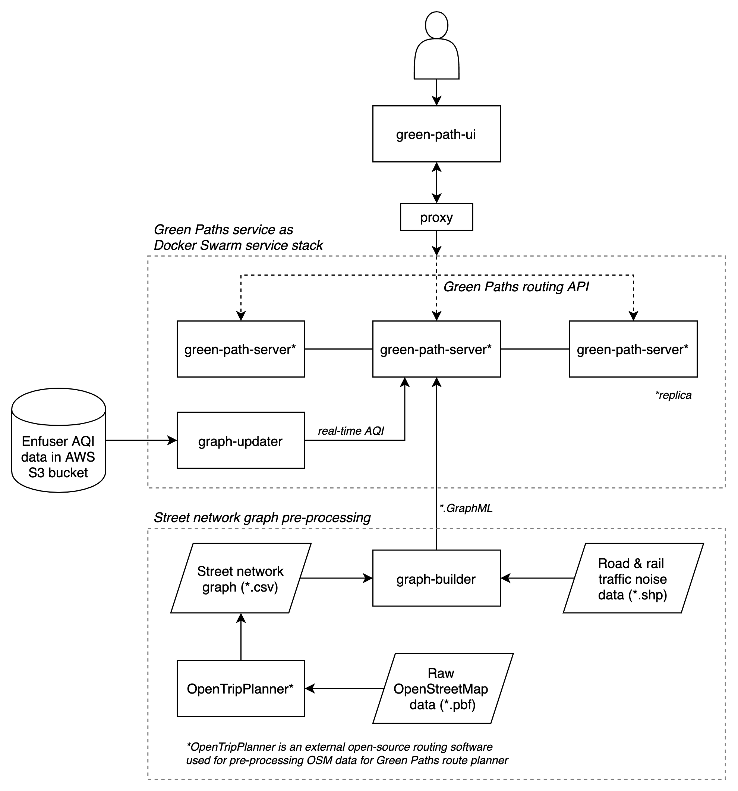

# green-paths

Green Paths is an open source route planner being developed in Digital Geography Lab, University of Helsinki, currently in the project [UIA HOPE](https://ilmanlaatu.eu/briefly-in-english/) – Healthy Outdoor Premises for Everyone funded by [Urban Innovative Action](https://www.uia-initiative.eu/en/uia-cities/helsinki). Its goal is to inform people on fresh air and quiet routes for walking and cycling in Helsinki region. 

It utilizes Air Quality Index (AQI) data from the [FMI-ENFUSER](https://en.ilmatieteenlaitos.fi/environmental-information-fusion-service) modelling system (by the Finnish Meteorological Institute) and modelled [traffic noise data](www.syke.fi/en-US/Open_information/Spatial_datasets/Downloadable_spatial_dataset#E) from the Helsinki capital region. AQI is based on real-time hourly data as a composite measure of NO2, PM2.5, PM10, SO2 and O3. 

Currently implemented features include calculation of unpolluted and quiet paths for both walking and cycling with respect to real-time air quality and typical (day-evening-night time) noise levels from road and rail traffic. The exposure-based routing method (and application) is based on [an MSc thesis](https://github.com/hellej/quiet-paths-msc). 

Live demo: [green-paths.web.app](https://green-paths.web.app/)

## Components

- [hope-green-path-ui](https://github.com/DigitalGeographyLab/hope-green-path-ui)
- [hope-green-path-server](https://github.com/DigitalGeographyLab/hope-green-path-server)
- [hope-graph-builder](https://github.com/DigitalGeographyLab/hope-graph-builder)
- [hope-graph-updater](https://github.com/DigitalGeographyLab/hope-graph-updater)  

## Materials

* [Green Paths project website](https://www.helsinki.fi/en/researchgroups/digital-geography-lab/green-paths)
* [UIA HOPE project](https://ilmanlaatu.eu/briefly-in-english/)
* [FMI-Enfuser model](https://en.ilmatieteenlaitos.fi/environmental-information-fusion-service)
* [SYKE - Traffic noise modelling data from Helsinki urban region](https://www.syke.fi/en-US/Open_information/Spatial_datasets/Downloadable_spatial_dataset#E)
* [Traffic noise zones in Helsinki 2017](https://hri.fi/data/en_GB/dataset/helsingin-kaupungin-meluselvitys-2017)
* [OpenStreetMap](https://www.openstreetmap.org/about/)

## Tech

Server & data processing: Python 3.8, igraph, GeoPandas, Shapely, Flask & Gunicorn  
UI: React, Redux & Thunk, Mapbox GL JS & Turf.js, TypeScript

## Green paths routing API

See [docs/green_paths_api.md](https://github.com/DigitalGeographyLab/hope-green-path-server/blob/develop/docs/green_paths_api.md) for detailed documentation (endpoints etc.) of the green paths routing API.

## Contributing

* See also [CONTRIBUTING.md](CONTRIBUTING.md)
* Please bear in mind that the current objective of the project is to develop a proof-of-concept of a green path route planner rather than a production ready service
* You are most welcome to add feature requests or bug reports in the issue trackers of the related projects
* When contributing to the project, please first discuss the change you wish to make via issue,
email, or any other method with the owners of this repository before making a change (firstname.lastname@helsinki.fi)
* Simple typo fixes etc. can be sent as PRs directly, but for features or more complex bug fixes please add a corresponding issue first for discussion

## License

[MIT](LICENSE)
